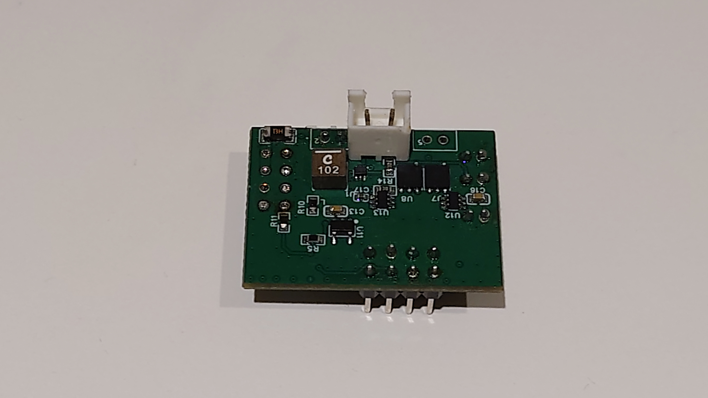
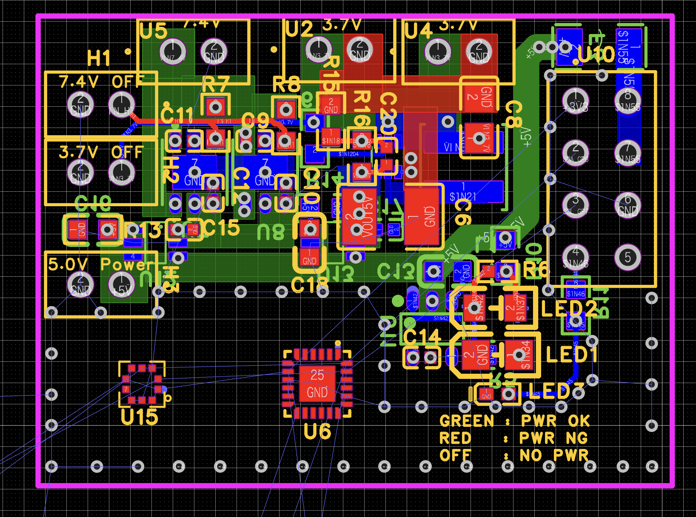

# 樋川 颯人 / Hayato Hikawa

## 技術的に正しいだけでなく、人と社会にとって価値のある解決を設計したい

私は、神山まるごと高専でハードウェア、AIソフトウェア、ロボット開発に取り組んでいます。

中学生の頃、私が見ていたのは回路や基板でした。
しかし、ロケット開発、40人を超えるチームでの活動、Atraの開発を経験するなかで、技術だけを正しくつくっても、物事は前に進まないと知りました。

必要な情報が届かない。判断の前提が共有されない。現場で故障原因を特定できない。誰が決めるのかが曖昧になる。目の前の作業に追われ、本当に解くべき問題を見失う。

異なる現場で、同じ種類の問題が何度も現れました。

そこで私は、設計を次のように捉えるようになりました。

> **設計力とは、起こり得ることを想定し、人・時間・情報・環境まで含めて、より良い選択肢を組み立てる力である。**

そして、人が想定できる範囲は、その人の想像力と経験、使える思考の枠組みに依存します。
だから私は、自分と異なる背景を持つ人と協働し、自分が無意識に置いている前提を壊したいと考えています。

目指しているのは、技術的な正しさを土台としながら、実際に使う人や組織、文化にとって、より大きな価値を生む問題解決です。

---

## 変わらなかった問いと、変わった答え

神山まるごと高専を志望したとき、私はこれからの社会で不可欠なのは「課題発見・解決能力」だと考えていました。

その力を、

- 抽象と具体を自在に往復する力
- ゼロから1を生み出す創造力
- アイデアを現実にする実行力

の三つに分け、テクノロジー、デザイン、起業家精神を横断して鍛えたいと志望理由書に書きました。

この問題意識は今も変わっていません。
一方で、入学前の私は、優れた技術とアイデアがあれば課題を解決できると考えていました。

今は、価値ある解決には、技術だけでなく、利用する人、現場の制約、組織の情報伝達、文化によって異なる前提まで理解する必要があると考えています。

私の関心は、「何をつくれるか」から、**何を問題として捉え、誰と、どのような前提で解決するか**へ広がりました。

---

## My Story

### 1. 回路図の外側まで設計する — CanSat・ロケット開発

中学生の頃、CanSatとロケットの開発に取り組み、ロケット甲子園の全国大会に出場しました。

全国大会では、設定した高度でパラシュートを展開するシステムを搭載したロケットを制作し、私は電装系、特に電子回路と基板設計を担当しました。

<table>
  <tr>
    <td width="50%">
      
      
<b>製作したロケット搭載基板</b>

    </td>
    <td width="50%">
      
      
<b>PCBレイアウト</b>

    </td>
  </tr>
</table>

基板を設計するとき、私は「正常に動くこと」だけではなく、大会や実験の現場で使う人が何に困るかを考えました。

- 2種類の入力電圧へ対応し、現場で切り替えられるよう短絡式コネクタを採用
- 電源状態をその場で確認し、デバッグを容易にするためのLED表示を実装
- 限られた実験時間でも原因を切り分けられるよう、柔軟性と冗長性を確保

これらは目立つ機能ではありません。しかし、実際の現場では、性能だけでなく、異常を見つけられること、状況に合わせて変更できること、失敗から復帰できることが重要です。

この経験から、設計とは実装方法を決めることではなく、**利用する状況と失敗の可能性まで想像し、先回りして選択肢を用意すること**だと学びました。

---

### 2. チームも一つのシステムである — FRC Team Hanabi

高専入学後、世界規模の高校生ロボット競技であるFIRST Robotics Competitionに出場する、FRC Team Hanabiに参加しました。

Hanabiには40人を超えるメンバーが所属し、ロボット制作だけでなく、資金調達、社会貢献活動、広報、遠征準備までを学生主体で進めています。
私はロボットの設計に加え、資金調達と社会貢献活動の管轄を担当しています。

ここで直面したのは、ロケット開発よりも大きな規模の「設計」の問題でした。

技術的に優れた案があっても、目的や判断の前提が共有されなければ実行されません。ある部門の変更が別の部門へ伝わらなければ、全体では矛盾が生まれます。人数が増えるほど、個人の努力だけでは解決できない問題も増えていきました。

私はこの環境から、チームも一つのシステムであり、成果は個人の能力だけでなく、**情報の流れ、意思決定の方法、役割への理解、互いの信頼**によって決まると学びました。

同時に、自分の考えを通すことよりも、立場の異なる人が何を見ているのかを理解し、全体として前へ進めることの重要性を知りました。

---

### 3. 異なる現場に同じ構造があった — Atra

ロケットとHanabiで経験した問題は、日々の学習やソフトウェア開発でも現れました。

神山まるごと高専では、授業、プロジェクト、課外活動が同時に進み、Slack、GitHub、カレンダー、資料などに情報が分散します。私自身も学校全体も、仕事を始める前の情報探索・照合・整理に時間を使い、必要な前提を見落としたまま動いてしまう構造的な問題を抱えています。

この問題に対して開発しているのが、**Atra**です。

Atraは、仕事を始める前に必要な情報探索・照合・整理を終わらせ、状況を理解したうえで「正しい最初の行動」へ到達するためのソフトウェアです。本プロジェクトは、地域版未踏型プログラムであるLE四国に採択されました。

Atraの出発点は、遠くにいる架空のユーザーではありません。
私自身と、生活している学校で繰り返し観測してきた問題です。

一方、Atraをつくる過程では、AIによる開発速度が上がるほど、人間が生成物や判断の背景を理解できなくなる「認知負債」にも直面しました。

そのため現在は、機能を増やすことだけではなく、検証・監査を再現でき、人が判断と責任を手放さずに使える環境の設計を重視しています。

Atraは完成した答えではありません。
ロケット、Hanabi、学校生活で出会った問題を、個人の不注意ではなく、人・情報・意思決定の構造として問い直すための実験です。

---

## なぜ米国なのか

私が海外へ行きたい理由は、海外経験そのものを得るためではありません。

設計力は、想定できる範囲に依存します。そして、想定できる範囲は、自分の想像力と経験だけでつくられた前提に制約されます。

同じ環境、似た価値観、共通した経験の中だけで考えていると、どれほど論理的に設計しても、そもそも検討できる選択肢が狭い可能性があります。

米国は、多様な人種的・文化的背景を持つ人々が共存し、世界の技術や経済に大きな影響を与える挑戦が数多く生まれている場所です。そこでは、立場や年齢にかかわらず意見を交わし、既存の前提や仕組み全体を問い直す試みが行われています。

もちろん、米国を一つの文化として単純化することはできません。だからこそ、その内部にある異なる価値観や対立を含めて、現地で人と協働する必要があると考えています。

私は、日本で実物を確実に動かすための緻密さや、現場の制約に向き合う経験を積んできました。そこへ、米国の多様な人々との対話や、既存の全体を組み替える発想を加えることで、自分の設計の前提を更新したいです。

そして、一方の方法をもう一方へそのまま輸入するのではなく、日米それぞれの経験と視点を接続し、**技術的に正しく、同時に異なる人や社会にとって価値のある選択肢**を提示できる人になりたいと考えています。

---

## Why TOMODACHI Boeing Entrepreneurship Seminar

TOMODACHI Boeing Entrepreneurship Seminarには、プロジェクト立案、ユーザーリサーチ、チーム開発、社会実装、英語での発表、異なるバックグラウンドを持つ人との協働が一つの過程として組み込まれています。

これは、私が現在持っている問いを、頭の中の思想ではなく、他者と検証するために必要な環境です。

### 1. 自分の仮説を、ユーザーの現実によって壊す

私は問題を抽象化し、自分なりの仮説へ整理することを得意としています。
しかし、考え抜いた仮説ほど、自分の経験に閉じる危険があります。

ユーザーリサーチを通じて、自分が解きたい問題ではなく、相手が実際に抱えている問題を理解し、仮説を変更する力を身につけたいです。

### 2. 異なる前提を、対立ではなく設計資源に変える

Hanabiでは40人を超えるチームで活動していますが、学校や競技という大きな前提は共有しています。

TOMODACHIでは、地域、専門、年齢、文化の異なる人と協働し、意見の違いを避けるのではなく、自分一人では想定できなかった選択肢を生む材料へ変えたいです。

### 3. 日米の違いを、将来の問題解決へ接続する

英語で自分の考えを伝えるだけでなく、米国の研究者、起業家、技術者が、どのように問題を発見し、既存の前提を問い直し、社会実装へ進めているのかを学びたいです。

その経験を日本へ持ち帰り、日本で得た現場感覚と組み合わせながら、将来的には日米の人々が互いの前提を持ち寄って、新しい技術や事業を設計できる関係づくりに関わりたいです。

---

## 私がチームへ持ち込めるもの

私が持ち込めるのは、完成された答えではなく、異なる領域をつなぎながら問いを深める姿勢です。

- 抽象的な問題と具体的な実装を往復する視点
- 利用現場と故障時まで想像してハードウェアを設計した経験
- 40人を超えるチームで、技術・資金調達・社会貢献を横断してきた経験
- AIを使いながら、人間の理解と責任を残す方法にも向き合ってきた経験
- 失敗を個人の能力不足だけで終わらせず、仕組みの問題として捉え直す姿勢
- 自分の前提を他者へ開き、考えを更新し続ける意志

私は、最初から正解を示す人ではなく、問いを明確にし、異なる意見をつなぎ、チームが次の一歩を選べる状態をつくる人でありたいです。

---

## 今、向き合っている問い

> **技術が人の行動を速くする時代に、人が考え、判断し、責任を持ち続けながら、より価値のある行動を選べる仕組みをどう設計できるか。**

中学生の頃は、一枚の基板をどう動かすかを考えていました。
今は、人と情報と意思決定がどうつながれば、チームや社会がより良い方向へ動けるかを考えています。

次は、この問いを自分一人の経験から切り離し、異なる地域、文化、専門を持つ人たちと検証したいです。

---

## English Summary

I am Hayato Hikawa, a student at Kamiyama Marugoto College of Technology.

My journey began with CanSat and rocket development in middle school. I competed in the national Rocket Koshien competition and designed the electronics and PCB for a rocket equipped with a parachute deployment system. I designed not only for technical performance, but also for field use: selectable input voltages, visible power-status LEDs, and easier debugging during limited test time.

Through rocket development, FRC Team Hanabi, and my AI software project Atra, I learned that technology alone does not move a project forward. Information must reach the right people, assumptions must be shared, and solutions must reflect the people and environments in which they are used.

I now see design as the ability to anticipate possibilities and build better choices across technology, people, time, information, and context. However, what I can anticipate is limited by my own imagination and experience.

That is why I want to collaborate with people from different cultural and professional backgrounds, especially in the United States. By challenging assumptions I do not yet recognize, I want to design solutions that are not only technically correct, but also more valuable to different people and societies.

I want to join the TOMODACHI Boeing Entrepreneurship Seminar to test my ideas with users, turn differences into better design choices, and connect what I have learned in Japan with new perspectives from the United States.