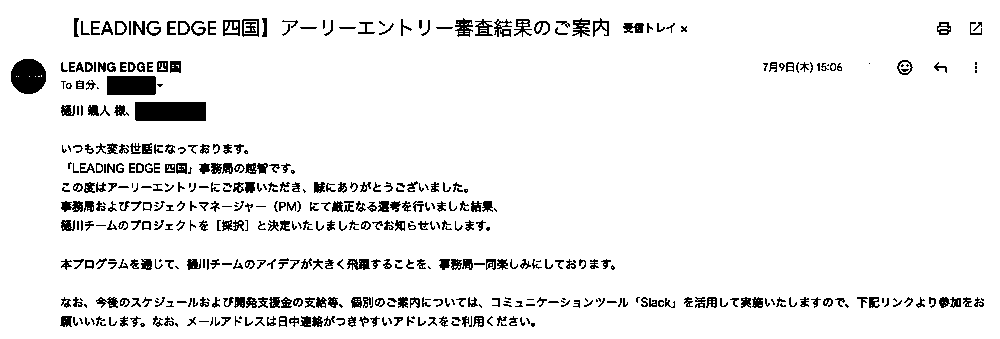

# 採択実績 — LEADING EDGE四国

[← READMEへ戻る](../README.md)

## LEADING EDGE四国（LE四国）

| 項目 | 内容 |
| --- | --- |
| 採択名 | LEADING EDGE四国（LE四国） |
| 対象プロジェクト | [Atra](atra.md) |

## この実績から分かること

LEADING EDGE四国は、四国にゆかりのある若い人材のアイデアと企業をつなぐオープンイノベーションプログラムです。Atraは、その枠組みで支援対象に選ばれました。

採択は、Atraの問題設定と提案が支援対象として選ばれたことを示します。製品の完成や事業の成功を意味するものではありません。

## 採択通知

*LEADING EDGE四国から届いた採択通知。共同応募者名と宛先情報は非表示にしています。*

## 関連資料

- [LEADING EDGE四国 公式サイト](https://www.leadingedge-shikoku.com/) — プログラムの概要
- [Atra / WorkUnit OS](https://github.com/haya10hikawa-hub/Atra-workunitOS) — 採択対象となったプロジェクト

## 関連する経験

FRC Team Hanabiでの経験は、技術だけでなく資金調達や社会貢献も含めてチームを動かす視点につながっています。詳しくは[設計に対する考え方](design-philosophy.md)にまとめています。

[← READMEへ戻る](../README.md)
