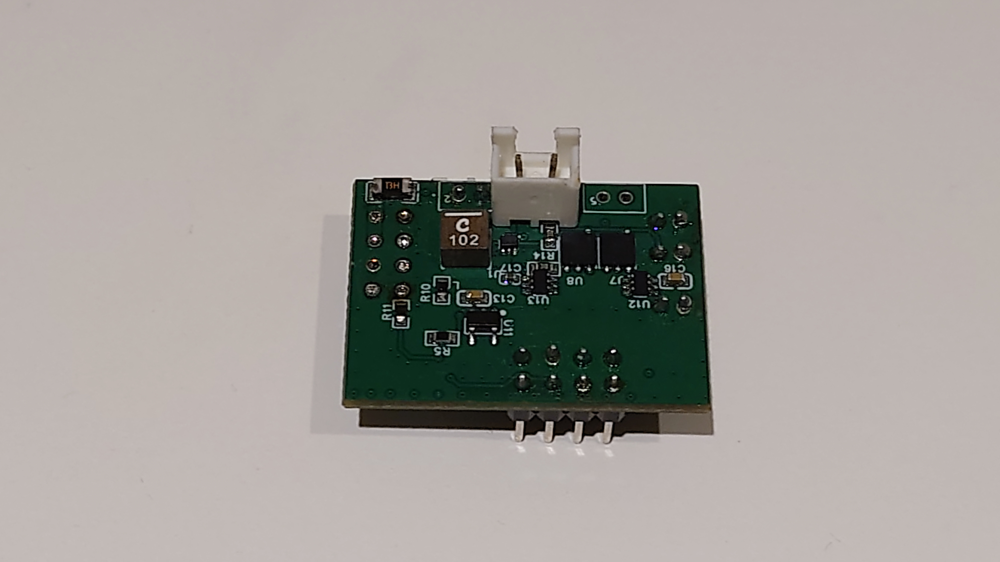

[← READMEへ戻る](../README.md)

# CanSat・ロケット開発 — 現場で確認・切り分け・復旧できる電装

## 概要

中学生の頃、CanSat・ロケット開発に取り組み、ロケット甲子園の地方大会と全国大会にチームで出場しました。私は電装系、特に電子回路と基板設計を担当しました。

## 問題と背景

ロケットの電装は、設計どおりに動くだけでは十分ではありません。限られた準備・実験時間の中で、電源の状態を確認し、変更箇所を切り分け、異常から復帰できる必要があります。

## 担当

- 電子回路の設計
- PCB（プリント基板）の設計
- 基板の製作・組み立て
- 電源とセンサーの基本動作確認

## 作ったもの

搭載基板には、MPU6500（姿勢・加速度などを測るセンサー）とBMP390（気圧を測るセンサー）、電源回路、I2C通信を組み込みました。大会用ロケットでは、設定した高度でパラシュートを展開するシステムに用いる電装として設計しました。

| 資料 | 内容 |
| --- | --- |
|  | 製作・組み立てた搭載基板 |
| [PCBレイアウト](../assets/rocket/rocket-pcb-layout.png) | 部品配置・配線を検討したレイアウト |
| [回路図](../assets/rocket/rocket-schematic.png) | 電源、センサー、通信を含む回路図 |

## 設計上の判断

- 2種類の入力電圧に対応し、現場で切り替えられる短絡式コネクタを採用しました。
- 電源状態をその場で確認できるよう、LED表示を設けました。
- 限られた実験時間で原因を切り分けられるよう、変更しやすさと冗長性を意識しました。

## 成果と関連資料

地方大会では所属チームが優勝し、全国大会への推薦を得ました。全国大会にもチームで出場しましたが、ここでは順位や記録を扱いません。

- [鹿児島大会に関する第三者発表](https://prtimes.jp/main/html/rd/p/000000007.000169767.html) — 地方大会の結果と全国大会への推薦

## 限界

電源ラインのノイズと安定性、部品配置・配線の見直しが改善点として残っています。

## ここから得たこと

回路図の上で正しくても、現場で異常に気づけなければ使えません。この開発を通じて、性能だけでなく、確認・変更・切り分け・復旧までを設計に含めるようになりました。

[← READMEへ戻る](../README.md)
